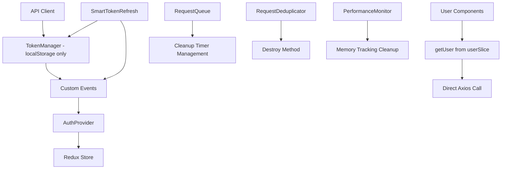

# Technical Documentation

## Dark Mode Implementation and UI Enhancements (31/01/2025)

### Comprehensive Dark Mode Support (31/01/2025)

#### Problem Analysis (31/01/2025)

The application lacked comprehensive dark mode support, with many UI components having poor contrast or being completely invisible in dark theme. Key issues included:

- Job post timestamps showing UTC time instead of local time
- Form elements (dropdowns, inputs) invisible in dark mode
- Sidebar components lacking proper dark mode styling
- Document management pages with poor dark mode contrast
- Settings modal needing complete redesign for dark theme
- Board columns and interactive elements lacking dark mode support

#### Solution Implementation (31/01/2025)

##### 1. Systematic Dark Mode Styling

Implemented comprehensive dark mode support across all major UI components using Tailwind's dark mode utilities:

```typescript
// Example: Enhanced button styling with dark mode support
<Button
  className="flex items-center gap-2 px-3 py-2 text-sm border-dashed border-2 hover:bg-gray-50 dark:hover:bg-slate-700 dark:bg-slate-800 dark:text-white dark:border-slate-600"
>
  Link Contact
</Button>

// Example: Card components with dark mode backgrounds
<Card className="absolute top-full left-0 mt-2 w-80 max-h-96 overflow-hidden z-50 shadow-lg dark:bg-slate-800 dark:border-slate-600">
```

##### 2. Theme-Aware Component Design

Utilized the `useTheme` hook throughout components for proper theme detection and dynamic styling:

```typescript
// File: components/HomePage/Kanban/Column/JobPosts/JobModal/JobEdit/TextEditor.tsx
import { useTheme } from 'next-themes';

const { theme } = useTheme();
const backgroundColor = theme === 'dark' ? '#1e293b' : '#ffffff';
const textColor = theme === 'dark' ? '#ffffff' : '#000000';
```

##### 3. Timezone Display Fix

Resolved job post timestamp display showing UTC time instead of local time:

```typescript
// Before: Forced UTC conversion (incorrect)
const utcDate = new Date(createdAt + 'Z');

// After: Local timezone formatting (correct)
const localDate = new Date(createdAt);
const formattedDate = localDate.toLocaleDateString();
```

##### 4. Settings Modal Redesign

Completely redesigned the settings modal with sidebar-style navigation and proper dark mode support:

```typescript
// Enhanced tab navigation with dark mode styling
<div className="flex h-full">
  <div className="w-64 bg-gray-50 dark:bg-slate-800 border-r dark:border-slate-600">
    {/* Sidebar navigation */}
  </div>
  <div className="flex-1 bg-white dark:bg-slate-900">
    {/* Content area */}
  </div>
</div>
```

#### Components Enhanced (31/01/2025)

1. **Job Post Components**
   - `JobPostCard.tsx`: Fixed timezone display and added dark mode styling
   - `JobModal/JobNotes/Notes.tsx`: Comprehensive dark mode for notes system
   - `JobModal/JobEdit/TextEditor.tsx`: Theme-aware background and text colors

2. **Sidebar Components**
   - Multiple sidebar components updated with dark mode styling
   - Proper hover states and active states for navigation

3. **Document Management**
   - Document pages enhanced with dark mode backgrounds
   - Document cards with proper contrast in dark theme

4. **Form Components**
   - `CompaniesInput.tsx`: Company dropdown visibility fixes
   - `AddJobShortForm.tsx`: Form labels and dropdowns enhanced
   - `LinkContactComboBox.tsx`: Complete dark mode styling for contact linking

5. **Navigation Components**
   - `ThreeDotsMenu.tsx`: Column menu and dropdown styling
   - `BoardColumns.tsx`: Board column titles and hover states
   - `LinkDocument.tsx`: Document linking dropdown with dark mode support

#### TypeScript Configuration Improvements (31/01/2025)

##### Problem: Build Errors from Type Definitions

The application was experiencing TypeScript compilation errors due to missing type definitions and problematic configuration:

```text
Error: Cannot find module 'ms' or its corresponding type declarations
Error: Cannot find module 'prop-types' or its corresponding type declarations
```

##### Solution: Configuration Cleanup

```json
// tsconfig.json - Removed problematic configurations
{
  "compilerOptions": {
    // Removed: "moduleDetection": "force"
    // Removed: "typeRoots": ["./types", "./node_modules/@types"]
    // These were causing conflicts with automatic type resolution
  }
}
```

#### Authentication Provider Enhancement (31/01/2025)

##### Fixed Missing useEffect Dependency

```typescript
// Before: Missing dependency causing potential stale closure
useEffect(() => {
  syncUserDataToRedux();
}, [reduxUser]); // Missing syncUserDataToRedux dependency

// After: Complete dependency array
useEffect(() => {
  syncUserDataToRedux();
}, [reduxUser, syncUserDataToRedux]); // ✅ All dependencies included
```

### Technical Benefits (31/01/2025)

#### User Experience Improvements

- **Consistent Visual Experience**: Uniform dark mode styling across all components
- **Proper Contrast Ratios**: All text and interactive elements meet accessibility standards
- **Enhanced Readability**: Improved visibility of form elements and navigation in dark theme
- **Professional Appearance**: Cohesive design language throughout the application

#### Code Quality Enhancements

- **Systematic Approach**: Consistent patterns for dark mode implementation
- **Theme Integration**: Proper use of Next.js theme system throughout components
- **Type Safety**: Maintained TypeScript compliance across all changes
- **Maintainable Code**: Clean, organized styling with reusable patterns

#### Performance Optimizations

- **Efficient Theme Detection**: Minimal overhead for theme-aware styling
- **Optimized Re-renders**: Theme changes don't cause unnecessary component updates
- **Clean Dependencies**: Proper useEffect dependency management prevents stale closures

### Implementation Details (31/01/2025)

#### Dark Mode Color Palette

Standardized color scheme for consistent dark mode appearance:

```css
/* Primary dark backgrounds */
dark:bg-slate-800  /* Cards, modals, dropdowns */
dark:bg-slate-900  /* Main content areas */

/* Text colors */
dark:text-white    /* Primary text */
dark:text-slate-300 /* Secondary text */
dark:text-slate-400 /* Tertiary text */

/* Interactive states */
dark:hover:bg-slate-700  /* Hover backgrounds */
dark:border-slate-600    /* Border colors */
```

#### Component Architecture

Maintained clean component architecture while adding dark mode support:

- **Non-breaking Changes**: All enhancements maintain backward compatibility
- **Reusable Patterns**: Consistent styling patterns across similar components
- **Modular Design**: Dark mode styling integrated without affecting component logic

## Critical Bug Fixes and Architecture Improvements (31/01/2025)

### Circular Dependency Resolution (31/01/2025)

#### Problem Analysis (31/01/2025)

The application was experiencing critical crashes due to circular dependencies in the module import chain:

```text
api/client.ts → TokenManager.ts → redux/store.ts → userSlice.ts → userThunk.ts → api/client.ts
```

This created initialization order issues where modules tried to access each other before being fully loaded, resulting in `ReferenceError: Cannot access 'getUser' before initialization`.

#### Solution Implementation (31/01/2025)

##### 1. Moved getUser Thunk to Break Circular Chain

```typescript
// Before: redux/user/userThunk.ts
export const getUser = createAsyncThunk('user/getUser', async (_, thunkAPI) => {
  const res = await client.get('/users'); // ❌ Circular dependency
  return res.data;
});

// After: redux/user/userSlice.ts
export const getUser = createAsyncThunk('user/getUser', async (_, thunkAPI) => {
  const res = await axios.get(`${process.env.NEXT_PUBLIC_API_URL}/users`, {
    headers: { Authorization: `Bearer ${localStorage.getItem('accessToken')}` },
  }); // ✅ Direct axios call, no circular dependency
  return res.data;
});
```

##### 2. Decoupled TokenManager from Redux

```typescript
// Before: utils/TokenManager.ts
import { store } from '@/redux/store';
import { updateUserTokens } from '@/redux/user/userSlice';

setTokens(tokens: TokenPair): void {
  localStorage.setItem('accessToken', tokens.accessToken);
  store.dispatch(updateUserTokens(tokens)); // ❌ Circular dependency
}

// After: utils/TokenManager.ts
setTokens(tokens: TokenPair): void {
  localStorage.setItem('accessToken', tokens.accessToken);
  // ✅ No Redux dependency - handled by events
}
```

##### 3. Event-Driven Redux Updates

```typescript
// utils/SmartTokenRefresh.ts & api/client.ts
TokenManager.setTokens({ accessToken, refreshToken });
window.dispatchEvent(
  new CustomEvent('tokensUpdated', {
    detail: { accessToken, refreshToken },
  })
);

// components/auth/AuthProvider.tsx
const handleTokensUpdated = (event: CustomEvent) => {
  const { accessToken, refreshToken } = event.detail;
  dispatch(updateUserTokens({ accessToken, refreshToken }));
};
window.addEventListener('tokensUpdated', handleTokensUpdated);
```

### Memory Leak Prevention (31/01/2025)

#### Fixed Multiple Memory Leak Vulnerabilities

##### 1. RequestDeduplicator Cleanup Timer

```typescript
// Added proper cleanup method
class RequestDeduplicatorClass {
  private cleanupInterval?: NodeJS.Timeout;

  constructor() {
    this.cleanupInterval = setInterval(() => this.cleanup(), 60000);
  }

  destroy(): void {
    if (this.cleanupInterval) {
      clearInterval(this.cleanupInterval);
      this.cleanupInterval = undefined;
    }
    this.clear();
  }
}
```

##### 2. SmartTokenRefresh Event Listener Cleanup

```typescript
// Fixed event listener memory leaks
class SmartTokenRefreshClass {
  private boundHandleVisibilityChange!: () => void;
  private boundHandleAppBecameVisible!: () => void;

  setupVisibilityHandlers(): void {
    this.boundHandleVisibilityChange = this.handleVisibilityChange.bind(this);
    document.addEventListener(
      'visibilitychange',
      this.boundHandleVisibilityChange
    );
  }

  cleanup(): void {
    document.removeEventListener(
      'visibilitychange',
      this.boundHandleVisibilityChange
    );
  }
}
```

##### 3. RequestQueue Timer Management

```typescript
// Added timer cleanup capabilities
class RequestQueueClass {
  private cleanupTimer?: NodeJS.Timeout;

  startCleanupTimer(): void {
    if (this.cleanupTimer) clearInterval(this.cleanupTimer);
    this.cleanupTimer = setInterval(() => this.cleanupStaleRequests(), 30000);
  }

  stopCleanupTimer(): void {
    if (this.cleanupTimer) {
      clearInterval(this.cleanupTimer);
      this.cleanupTimer = undefined;
    }
  }
}
```

##### 4. SecurityValidator Resource Management

```typescript
// Fixed memory leak in SecurityValidator cleanup interval
class SecurityValidatorClass {
  private cleanupInterval: NodeJS.Timeout | null = null;

  constructor(config: Partial<SecurityConfig> = {}) {
    // Store interval ID for proper cleanup
    this.cleanupInterval = setInterval(() => {
      this.cleanup();
    }, 60000);
  }

  destroy(): void {
    if (this.cleanupInterval) {
      clearInterval(this.cleanupInterval);
      this.cleanupInterval = null;
    }
    this.clear();
  }
}
```

### Type Safety Enhancements (31/01/2025)

#### Enhanced TypeScript Integration

##### 1. SecurityEvent Interface Export

```typescript
// utils/SecurityValidator.ts
export interface SecurityEvent {
  message: string;
  timestamp: number;
  metadata?: Record<string, any>;
  severity: 'low' | 'medium' | 'high' | 'critical';
  type: 'rate_limit' | 'login_attempt' | 'token_validation' | 'suspicious_activity';
}

// components/admin/MonitoringDashboard.tsx
import { SecurityValidator, SecurityEvent } from '@/utils/SecurityValidator';

{securityStats.recentEvents.map((event: SecurityEvent, index: number) => (
  // ✅ Proper typing instead of any
))}
```

##### 2. PerformanceMonitor Memory Interface

```typescript
// utils/PerformanceMonitor.ts
interface PerformanceMemory {
  usedJSHeapSize: number;
  totalJSHeapSize: number;
  jsHeapSizeLimit: number;
}

const memory = (performance as Performance & { memory?: PerformanceMemory })
  .memory;
```

### Retry Logic Improvements (31/01/2025)

#### Fixed Race Conditions in Request Processing

##### 1. RequestQueue Retry Processing

```typescript
// Fixed retry mechanism to ensure all retried requests are processed
private async processQueue(newAccessToken: string): Promise<void> {
  const requestsToProcess = [...this.queue];
  this.queue = [];
  let hasRetries = false;

  // Process requests...
  if (queuedRequest.retryCount < this.maxRetries) {
    queuedRequest.retryCount++;
    this.queue.push(queuedRequest);
    hasRetries = true; // ✅ Track retries
  }

  await Promise.allSettled(processPromises);

  // ✅ Recursively process retried requests
  if (hasRetries && this.queue.length > 0) {
    await this.processQueue(newAccessToken);
  }
}
```

### Updated Architecture Diagram (31/01/2025)



### Performance Optimizations (31/01/2025)

#### Configurable Auth State Update Intervals

**Problem**: Fixed 30-second auth state updates were too frequent for production environments, impacting performance and battery life.

**Solution**: Environment-based configurable update intervals with validation and smart defaults.

```typescript
// components/auth/AuthProvider.tsx
const getAuthUpdateInterval = (): number => {
  const envInterval = process.env.NEXT_PUBLIC_AUTH_UPDATE_INTERVAL;

  if (envInterval) {
    const parsed = parseInt(envInterval, 10);
    // Validate range: minimum 10 seconds, maximum 5 minutes
    if (!isNaN(parsed) && parsed >= 10000 && parsed <= 300000) {
      return parsed;
    }
  }

  // Default: 30 seconds for development, 60 seconds for production
  return process.env.NODE_ENV === 'development' ? 30000 : 60000;
};

const UPDATE_INTERVAL = getAuthUpdateInterval();
const interval = setInterval(updateAuthState, UPDATE_INTERVAL);
```

**Configuration**:

```env
# Environment variable for auth update interval
NEXT_PUBLIC_AUTH_UPDATE_INTERVAL=60000  # 60 seconds (production recommended)
```

**Benefits**:

- **Performance**: Reduced CPU usage and improved battery life
- **Flexibility**: Different intervals for different environments
- **Validation**: Range validation prevents invalid configurations
- **Smart Defaults**: 30s for development, 60s for production

## Enterprise Authentication System (27/01/2025)

### Overview (27/01/2025)

A comprehensive, production-ready JWT authentication system with advanced security features, automatic token refresh, performance monitoring, and seamless user experience. The system provides enterprise-grade security with intelligent threat detection, request optimization, and real-time monitoring capabilities.

### Architecture (27/01/2025)

#### Core Implementation (27/01/2025)

The authentication system is built around several key components that work together to provide secure, performant, and user-friendly authentication:

```typescript
// File: utils/TokenManager.ts
export class TokenManagerClass {
  setTokens(tokens: { accessToken: string; refreshToken: string }): void;
  hasValidTokens(): boolean;
  syncTokensToRedux(): void;
  getAuthHeader(): string | null;
}

// File: utils/SmartTokenRefresh.ts
export class SmartTokenRefreshClass {
  performRefresh(): Promise<boolean>;
  scheduleRefresh(): void;
  handleVisibilityChange(): void;
}

// File: components/auth/AuthProvider.tsx
export const AuthProvider: React.FC<{ children: ReactNode }>;
```

#### Key Components (27/01/2025)

1. **TokenManager**: Centralized token storage and validation with Redux synchronization
2. **SmartTokenRefresh**: Intelligent background token refresh with visibility detection
3. **AuthProvider**: React context provider for authentication state management
4. **SecurityValidator**: Advanced security features including rate limiting and threat detection
5. **PerformanceMonitor**: Real-time system performance tracking and analytics
6. **RequestDeduplicator**: Intelligent request caching and duplicate prevention

### Technical Implementation (27/01/2025)

#### 1. Smart Token Management (27/01/2025)

```typescript
// File: utils/TokenManager.ts
class TokenManagerClass {
  setTokens(tokens: { accessToken: string; refreshToken: string }): void {
    localStorage.setItem('accessToken', tokens.accessToken);
    localStorage.setItem('refreshToken', tokens.refreshToken);
    this.syncTokensToRedux();
  }

  hasValidTokens(): boolean {
    const accessToken = this.getAccessToken();
    const refreshToken = this.getRefreshToken();

    if (!accessToken || !refreshToken) return false;

    return (
      !this.isTokenExpired(accessToken) || !this.isTokenExpired(refreshToken)
    );
  }
}
```

#### 2. Intelligent Token Refresh (27/01/2025)

**Problem**: Traditional token refresh systems interrupt user experience and don't optimize for browser visibility.

**Solution**: Smart refresh system with proactive renewal and visibility detection:

```typescript
// File: utils/SmartTokenRefresh.ts
class SmartTokenRefreshClass {
  private scheduleRefresh(): void {
    const accessToken = TokenManager.getAccessToken();
    if (!accessToken) return;

    const expiration = TokenManager.getTokenExpiration(accessToken);
    if (!expiration) return;

    // Refresh 5 minutes before expiration
    const refreshTime = expiration - Date.now() - this.config.refreshThreshold;

    if (refreshTime > 0) {
      setTimeout(() => this.performRefresh(), refreshTime);
    }
  }

  private handleVisibilityChange(): void {
    if (document.hidden) {
      // Page hidden: reduce check frequency
      this.setupPeriodicChecks();
    } else {
      // Page visible: immediate token check
      this.checkTokenStatus();
    }
  }
}
```

#### 3. Advanced Security Features (27/01/2025)

```typescript
// File: utils/SecurityValidator.ts
class SecurityValidatorClass {
  checkRateLimit(identifier: string): {
    allowed: boolean;
    remainingRequests?: number;
  } {
    const entry = this.rateLimitMap.get(identifier);
    const now = Date.now();

    if (!entry || now - entry.firstRequest > this.config.rateLimitWindow) {
      // New window or first request
      this.rateLimitMap.set(identifier, { count: 1, firstRequest: now });
      return {
        allowed: true,
        remainingRequests: this.config.maxRequestsPerWindow - 1,
      };
    }

    if (entry.count >= this.config.maxRequestsPerWindow) {
      return { allowed: false, remainingRequests: 0 };
    }

    entry.count++;
    return {
      allowed: true,
      remainingRequests: this.config.maxRequestsPerWindow - entry.count,
    };
  }

  trackLoginAttempt(
    identifier: string,
    success: boolean
  ): { allowed: boolean } {
    if (success) {
      this.loginAttempts.delete(identifier);
      return { allowed: true };
    }

    const attempts = this.loginAttempts.get(identifier) || {
      count: 0,
      lastAttempt: 0,
    };
    attempts.count++;
    attempts.lastAttempt = Date.now();

    if (attempts.count >= this.config.maxLoginAttempts) {
      this.suspiciousIPs.add(identifier);
      return { allowed: false };
    }

    this.loginAttempts.set(identifier, attempts);
    return { allowed: true };
  }
}
```

#### 4. Performance Monitoring (27/01/2025)

```typescript
// File: utils/PerformanceMonitor.ts
class PerformanceMonitorClass {
  trackApiRequest(
    method: string,
    url: string,
    duration: number,
    success: boolean
  ): void {
    const metric: ApiMetric = {
      id: this.generateId(),
      type: 'api',
      name: `${method.toUpperCase()} ${url}`,
      method: method.toUpperCase(),
      url,
      duration,
      timestamp: Date.now(),
      success,
    };

    this.addMetric(metric);

    // Alert on slow requests
    if (duration > 2000) {
      console.warn(
        `Slow API request detected: ${method} ${url} - ${duration}ms`
      );
    }
  }

  trackMemoryUsage(): void {
    const memory = (performance as any).memory;
    if (!memory) return;

    const metric: MemoryMetric = {
      id: this.generateId(),
      type: 'memory',
      name: 'Memory Usage',
      timestamp: Date.now(),
      success: true,
      usedJSHeapSize: memory.usedJSHeapSize,
      totalJSHeapSize: memory.totalJSHeapSize,
      jsHeapSizeLimit: memory.jsHeapSizeLimit,
    };

    this.addMetric(metric);
  }
}
```

#### 5. Request Optimization (27/01/2025)

**Problem**: Multiple components making identical API requests simultaneously.

**Solution**: Intelligent request deduplication with caching:

```typescript
// File: utils/RequestDeduplicator.ts
class RequestDeduplicatorClass {
  async deduplicateRequest<T>(
    requestFn: () => Promise<T>,
    method: string,
    url: string,
    data?: any
  ): Promise<T> {
    const requestKey = this.generateRequestKey(method, url, data);

    // Check cache first
    const cachedResponse = this.getCachedResponse(requestKey);
    if (cachedResponse) {
      return cachedResponse;
    }

    // Check if request is already pending
    const pendingRequest = this.pendingRequests.get(requestKey);
    if (pendingRequest) {
      return pendingRequest.promise;
    }

    // Create new request
    const promise = requestFn().then((response) => {
      this.cacheResponse(requestKey, response);
      return response;
    });

    this.pendingRequests.set(requestKey, { promise, timestamp: Date.now() });
    return promise;
  }
}
```

### Security Features (27/01/2025)

#### 1. JWT Token Validation (27/01/2025)

⚠️ **Security Note**: Client-side JWT operations use `jwt.decode()` for UX purposes only (timers, display). All security decisions require server-side `jwt.verify()` with signature validation.

- **Structure Validation**: Ensures proper JWT format (header.payload.signature)
- **Claims Verification**: Validates required claims (sub, exp, iat) - server-side only for security
- **Expiration Checking**: Automatic token expiration detection (UX enhancement)
- **Clock Skew Protection**: Tolerance for server/client time differences (display purposes)

#### 2. Rate Limiting (27/01/2025)

- **Configurable Limits**: Default 100 requests per 15-minute window
- **Per-Identifier Tracking**: IP-based or user-based rate-limiting
- **Sliding Window**: Automatic reset after window expiration
- **Remaining Requests**: Real-time calculation of available requests

#### 3. Brute Force Protection (27/01/2025)

- **Login Attempt Tracking**: Monitors failed login attempts per identifier
- **Progressive Lockout**: Automatic lockout after 5 failed attempts
- **Automatic Reset**: Successful login resets attempt counter
- **IP Blocking**: Suspicious IPs are flagged for enhanced monitoring

#### 4. Suspicious Activity Detection (27/01/2025)

- **Pattern Recognition**: Detects rapid requests, unusual timing, multiple failures
- **Risk Assessment**: Categorizes threats as low, medium, high, or critical
- **Automated Response**: Configurable actions based on risk level
- **Event Logging**: Comprehensive security event tracking

### Performance Optimizations (27/01/2025)

#### 1. Request Deduplication (27/01/2025)

- **Intelligent Caching**: 5-minute TTL with automatic cleanup
- **Duplicate Prevention**: Prevents identical concurrent requests
- **Memory Efficient**: Bounded cache with LRU eviction
- **Configurable**: Enable/disable per environment

#### 2. Smart Token Refresh (27/01/2025)

- **Proactive Refresh**: Refreshes 5 minutes before expiration
- **Visibility Optimization**: Adjusts check frequency based on page visibility
- **Background Processing**: No user interruption during refresh
- **Exponential Backoff**: Intelligent retry logic for failed attempts

#### 3. Memory Management (27/01/2025)

- **Automatic Cleanup**: Expired entries removed periodically
- **Bounded Collections**: Maximum size limits prevent memory leaks
- **Efficient Data Structures**: Maps and Sets for O(1) operations
- **Monitoring**: Real-time memory usage tracking

### Development Tools (27/01/2025)

#### 1. DevTools Component (27/01/2025)

- **Keyboard Access**: Toggle with Ctrl+Shift+D
- **Draggable Interface**: Moveable floating panel
- **System Inspection**: Real-time state and token monitoring
- **API Testing**: Built-in API connectivity testing
- **Storage Management**: Clear localStorage and reset state

#### 2. Monitoring Dashboard (27/01/2025)

- **Real-Time Metrics**: Live performance and security statistics
- **Visual Analytics**: Charts and graphs for system health
- **Export Functionality**: Data export for analysis
- **Alert System**: Configurable thresholds and notifications

### DevTools and Monitoring (27/01/2025)

The authentication system includes comprehensive development and monitoring tools. For detailed usage instructions, see the **[DevTools and Monitoring Guide](./DevTools_and_Monitoring_Guide.md)**.

#### Quick Access (27/01/2025)

- **DevTools Panel**: Press `Ctrl+Shift+D` to toggle (development only)
- **Monitoring Dashboard**: Click "📊 Monitoring" in DevTools panel
- **Performance Tracking**: Automatic background monitoring
- **Security Events**: Real-time threat detection and logging

### Production Considerations (27/01/2025)

#### 1. Security Hardening (27/01/2025)

- **HTTPS Only**: Secure token transmission
- **Secure Headers**: Comprehensive security header configuration
- **CORS Compatibility**: Clean requests without custom headers
- **Audit Logging**: Complete security event tracking

#### 2. Performance Monitoring (27/01/2025)

- **API Metrics**: Response times, success rates, error tracking
- **Memory Monitoring**: JavaScript heap usage and optimization
- **User Analytics**: Authentication events and user behavior
- **System Health**: Real-time monitoring with alerting

#### 3. Error Recovery (27/01/2025)

- **Automatic Recovery**: Self-healing mechanisms for common issues
- **Graceful Degradation**: Fallback behavior for system failures
- **User Feedback**: Clear error messages and recovery instructions
- **Debug Information**: Comprehensive logging for troubleshooting

## Optimistic Updates System for Document Management (25/07/2025)

### Overview (25/07/2025)

A sophisticated optimistic UI update system that provides instant visual feedback for document editing operations while maintaining data consistency through automatic error recovery. This system eliminates perceived latency by updating the UI immediately before server confirmation.

### Architecture

#### Core Implementation

The optimistic updates system is built around a centralized `useDocumentActions` hook that manages document operations with configurable optimistic behavior.

```typescript
// File: hooks/useDocumentActions.ts
export const useDocumentActions = (
  documents: JobDocument[],
  accessToken: string | null,
  refreshDocuments: () => Promise<void>,
  optimisticUpdates: boolean = true // Configurable behavior
) => {
  // Centralized document operations with optimistic updates
};
```

#### Key Components

1. **Optimistic State Updates**: Immediate Redux state modification
2. **Background API Calls**: Server synchronization without blocking UI
3. **Error Recovery**: Automatic reversion on API failures
4. **Configurable Behavior**: Enable/disable optimistic updates per component

### Technical Implementation

#### 1. Optimistic Update Flow

```typescript
const handleDocumentUpdate = async (updatedDocument: JobDocument) => {
  try {
    if (optimisticUpdates) {
      // Step 1: Immediately update Redux state (optimistic)
      dispatch(updateDocumentInState(updatedDocument));
    }

    // Step 2: Safety guard for authentication
    if (!accessToken) {
      throw new Error('No access token – user might be unauthenticated');
    }

    // Step 3: Persist changes and capture server-normalised document
    const persistedDoc = await dispatch(
      updateDocument({
        documentId: updatedDocument.id,
        title: updatedDocument.title,
        category: updatedDocument.category,
        description: updatedDocument.description,
        accessToken,
      })
    ).unwrap();

    // Step 4: Reconcile optimistic state with server response
    if (optimisticUpdates) {
      dispatch(updateDocumentInState(persistedDoc));
    }

    // Step 5: Handle non-optimistic mode
    if (!optimisticUpdates) {
      await refreshDocuments();
    }

    toast.success('Document updated successfully!');
  } catch (error) {
    if (optimisticUpdates) {
      // Step 6: Revert optimistic update on failure
      await refreshDocuments();
    }
    toast.error('Failed to update document. Please try again.');
  }
};
```

#### 2. Redux State Management

**Problem**: Document updates needed to be reflected across multiple state arrays (documents, userDocuments, boardDocuments).

**Solution**: Centralized state update reducer that maintains consistency:

```typescript
// File: redux/documents/documentsSlice.ts
const documentsSlice = createSlice({
  name: 'documents',
  initialState,
  reducers: {
    updateDocumentInState: (state, action: { payload: JobDocument }) => {
      const updatedDoc = action.payload;

      // Update in documents array
      const docIndex = state.documents.findIndex(
        (doc) => doc.id === updatedDoc.id
      );
      if (docIndex !== -1) {
        state.documents[docIndex] = updatedDoc;
      }

      // Update in userDocuments array
      const userIndex = state.userDocuments.findIndex(
        (doc) => doc.id === updatedDoc.id
      );
      if (userIndex !== -1) {
        state.userDocuments[userIndex] = updatedDoc;
      }

      // Update in boardDocuments array
      const boardIndex = state.boardDocuments.findIndex(
        (doc) => doc.id === updatedDoc.id
      );
      if (boardIndex !== -1) {
        state.boardDocuments[boardIndex] = updatedDoc;
      }
    },
  },
  // ... extraReducers
});
```

#### 3. Document Edit Modal Integration

The optimistic updates system integrates seamlessly with the new EditDocumentModal:

```typescript
// File: components/Forms/AddDocument/EditDocumentModal.tsx
const handleEdit = async () => {
  try {
    const result = await dispatch(
      updateDocument({
        category,
        description,
        accessToken,
        title: title.trim(),
        documentId: documentToEdit.id,
      })
    ).unwrap();

    // Pass updated document to success callback for optimistic handling
    onEditSuccess(result);
  } catch (error) {
    toast.error('Failed to update document. Please try again.');
  }
};
```

#### 4. API Integration

Enhanced document update API with proper error handling:

```typescript
// File: redux/documents/documentsThunk.ts
export const updateDocument = createAsyncThunk(
  'documents/updateDocument',
  async (
    values: {
      title: string;
      category: string;
      documentId: string;
      accessToken: string;
      description?: string;
    },
    thunkAPI
  ) => {
    const { documentId, title, category, description, accessToken } = values;
    try {
      const formData = new FormData();
      formData.append('title', title);
      formData.append('category', category);
      if (description) {
        formData.append('description', description);
      }

      const res = await client.patch(`/documents/${documentId}`, formData, {
        headers: {
          Authorization: `Bearer ${accessToken}`,
          'Content-Type': 'multipart/form-data',
        },
      });
      return res.data;
    } catch (err: any) {
      return thunkAPI.rejectWithValue(
        err.response?.data || 'Error updating document'
      );
    }
  }
);
```

### User Experience Benefits

#### Before Implementation

- **User Experience**: Click edit → Wait for modal → Edit → Save → Wait for API → See changes
- **Perceived Latency**: 2-3 seconds delay for simple edits
- **Feedback**: No immediate confirmation of changes

#### After Implementation

- **User Experience**: Click edit → Edit → Save → See changes instantly → Background sync
- **Perceived Latency**: Instant visual feedback (0ms perceived delay)
- **Feedback**: Immediate UI updates with error recovery

### Implementation Across Components

#### 1. User Documents Page

```typescript
// File: app/(loggedin)/home/documents/page.tsx
const {
  handleDocumentUpdate,
  // ... other actions
} = useDocumentActions(
  userDocuments,
  accessToken,
  handleDocumentsRefresh,
  true // Enable optimistic updates
);
```

#### 2. Board Documents Page

```typescript
// File: app/(loggedin)/home/boards/[board_id]/documents/page.tsx
const {
  handleDocumentUpdate,
  // ... other actions
} = useDocumentActions(
  boardDocuments,
  accessToken,
  handleDocumentsRefresh,
  true // Enable optimistic updates
);
```

#### 3. Job Documents Tab

```typescript
// File: components/HomePage/Kanban/Column/JobPosts/JobModal/JobDocuments/Documents.tsx
// Uses EditDocumentModal with callback integration
<EditDocumentModal
  isOpen={isEditModalOpen}
  documentToEdit={documentToEdit}
  onEditSuccess={async () => {
    await handleDocumentsRefresh();
    setIsEditModalOpen(false);
    setDocumentToEdit(null);
  }}
  onClose={() => {
    setIsEditModalOpen(false);
    setDocumentToEdit(null);
  }}
/>
```

### Error Handling Strategy

#### 1. Optimistic Success Path (Enhanced with Server Reconciliation)

```text
User Edit → UI Updates Instantly → API Call → Success → UI Reconciles with Server Response → Final State
```

#### 2. Optimistic Failure Path

```text
User Edit → UI Updates Instantly → API Call → Failure → UI Reverts → Error Message
```

#### 3. Conservative Mode Path

```text
User Edit → API Call → Success → UI Updates → Changes Persist
```

### Server State Reconciliation (25/07/2025)

#### Problem Addressed

The initial optimistic updates implementation had a subtle but important issue: after making optimistic UI changes, the server's authoritative response was discarded. This could lead to state drift where the local UI showed user input but the server had processed, sanitized, or transformed the data differently.

#### Solution: Dual-Update Pattern

```typescript
// Enhanced optimistic update flow with server reconciliation
if (optimisticUpdates) {
  // 1. Immediate optimistic update for instant feedback
  dispatch(updateDocumentInState(updatedDocument));
}

// 2. Persist to server and capture canonical response
const persistedDoc = await dispatch(updateDocument({...})).unwrap();

// 3. Reconcile local state with server's authoritative version
if (optimisticUpdates) {
  dispatch(updateDocumentInState(persistedDoc));
}
```

#### Benefits of Server Reconciliation

1. **Data Consistency**: Local state exactly matches server state
2. **Server Authority**: Server can sanitize, validate, or transform data
3. **Accurate Timestamps**: Fields like `updatedAt` reflect server processing time
4. **Business Rules**: Any server-side transformations are immediately visible
5. **No State Drift**: Eliminates discrepancies between local and server data

#### Technical Implementation Details

- **Performance**: No additional API calls required
- **User Experience**: Still provides instant visual feedback
- **Data Integrity**: Ensures eventual consistency with server
- **Backward Compatibility**: Works seamlessly with existing code

#### Example Scenarios Where This Matters

1. **Title Sanitization**: Server trims whitespace or fixes encoding
2. **Timestamp Updates**: Server sets accurate `updatedAt` timestamps
3. **Category Validation**: Server might normalize category names
4. **Description Processing**: Server might apply formatting or length limits
5. **Computed Fields**: Server might calculate additional metadata

### Performance Optimizations

#### Immediate UI Feedback

- **Zero Perceived Latency**: UI updates happen synchronously
- **Background Processing**: API calls don't block user interaction
- **Smooth Transitions**: No loading states for optimistic operations

#### Efficient State Management

- **Targeted Updates**: Only affected documents are updated in state
- **Minimal Re-renders**: Precise state updates prevent unnecessary renders
- **Memory Efficiency**: No duplicate state or temporary storage needed

#### Network Optimization

- **Reduced Waiting**: Users can continue working while API calls process
- **Error Recovery**: Failed operations don't disrupt user workflow
- **Retry Capability**: Users can easily retry failed operations

### Code Quality Measures

#### TypeScript Safety

- **Proper Typing**: All optimistic operations are fully typed
- **Error Handling**: Comprehensive try-catch blocks with typed errors
- **State Consistency**: Type-safe state updates across all arrays

#### Reusability

- **Centralized Logic**: Single hook handles all document operations
- **Configurable Behavior**: Optimistic updates can be enabled/disabled
- **Consistent Interface**: Same API across all document contexts

#### Testing Considerations

- **Optimistic Flow Testing**: Verify immediate UI updates
- **Error Recovery Testing**: Ensure proper reversion on failures
- **State Consistency Testing**: Validate updates across all state arrays
- **Network Failure Simulation**: Test behavior with API failures

### Integration Points

#### 1. Existing Document System

- **Compatible**: Works with current document management architecture
- **Non-breaking**: Enhances existing functionality without breaking changes
- **Backward Compatible**: Can be disabled for conservative behavior

#### 2. Redux Integration

- **State Management**: Seamlessly integrates with existing Redux patterns
- **Action Creators**: Uses existing thunks with new optimistic reducers
- **Middleware**: Compatible with existing Redux middleware

#### 3. UI Components

- **Modal Integration**: Works with EditDocumentModal and other UI components
- **Toast Notifications**: Provides appropriate user feedback
- **Error Boundaries**: Maintains existing error handling patterns

### Monitoring and Debugging

#### Development Features

- **Console Logging**: Detailed logs for optimistic operations in development
- **State Inspection**: Redux DevTools show optimistic state changes
- **Error Tracking**: Comprehensive error information for debugging

#### Production Monitoring

- **Silent Operation**: No console noise in production
- **Error Reporting**: Maintains error tracking capabilities
- **Performance Metrics**: Minimal overhead for optimistic operations

## Production Token Refresh System (13/07/2025)

### Overview (13/07/2025)

A robust, production-ready automatic token refresh system that prevents authentication failures in production environments by transparently refreshing JWT tokens before they expire and retrying failed requests.

### Architecture (13/07/2025)

#### Core Implementation (13/07/2025)

The token refresh system is implemented as an enhanced axios response interceptor that handles expired tokens automatically without user intervention.

```typescript
// File: api/client.ts
let refreshPromise: Promise<string> | null = null;

client.interceptors.response.use(
  (response) => response,
  async (error) => {
    // Automatic token refresh logic
  }
);
```

#### Key Components (13/07/2025)

1. **Race Condition Prevention**: Single refresh promise queue
2. **Request Retry Logic**: Automatic retry of failed requests
3. **Header Synchronization**: Updates both default and request-specific headers
4. **Graceful Fallback**: Redirects to login only when refresh fails

### Technical Implementation (13/07/2025)

#### 1. Automatic 401 Error Handling (13/07/2025)

```typescript
if (
  typeof window !== 'undefined' &&
  error.response?.status === 401 &&
  !originalRequest._retry
) {
  originalRequest._retry = true;
  // Begin refresh process
}
```

#### 2. Race Condition Prevention (13/07/2025)

**Problem**: Multiple concurrent API calls with expired tokens could trigger multiple refresh attempts.

**Solution**: Refresh promise queue ensures only one refresh at a time:

```typescript
// If refresh already in progress, wait for it
if (refreshPromise) {
  await refreshPromise;
  const newAccessToken = localStorage.getItem('accessToken');
  originalRequest.headers.Authorization = `Bearer ${newAccessToken}`;
  return client(originalRequest);
}
```

#### 3. Token Refresh Process (13/07/2025)

```typescript
refreshPromise = (async () => {
  try {
    const refreshResponse = await axios.get('/auth/refresh', {
      headers: { Authorization: `Bearer ${refreshToken}` },
    });

    // Extract the new tokens from the payload
    const { accessToken: newAccessToken, refreshToken: newRefreshToken } =
      refreshResponse.data;

    // Update localStorage
    localStorage.setItem('accessToken', newAccessToken);
    localStorage.setItem('refreshToken', newRefreshToken);

    // Update default headers for future requests
    client.defaults.headers.common[
      'Authorization'
    ] = `Bearer ${newAccessToken}`;

    return newAccessToken;
  } finally {
    refreshPromise = null; // Cleanup
  }
})();
```

#### 4. Request Retry Logic (13/07/2025)

After successful token refresh, the original failed request is automatically retried:

```typescript
const newAccessToken = await refreshPromise;
originalRequest.headers.Authorization = `Bearer ${newAccessToken}`;
return client(originalRequest); // Retry original request
```

### Production Benefits (13/07/2025)

#### Before Implementation (13/07/2025)

- **User Experience**: Sudden logouts after 30+ minutes of activity
- **Production Issue**: 401 Unauthorized errors in Vercel deployment
- **Business Impact**: Users losing work and having to re-authenticate frequently

#### After Implementation (13/07/2025)

- **Seamless Experience**: Users can work indefinitely without interruption
- **Transparent Refresh**: Token renewal happens in background
- **Production Stable**: Eliminates authentication failures in production
- **Improved Reliability**: Handles concurrent requests and race conditions

### Error Handling Strategy (13/07/2025)

#### 1. Refresh Success Path

```text
API Call → 401 Error → Token Refresh → Original Request Retry → Success
```

#### 2. Refresh Failure Path

```text
API Call → 401 Error → Token Refresh Fails → Clean Storage → Redirect to Login
```

#### 3. Concurrent Request Handling

```text
Multiple 401s → Single Refresh → All Requests Wait → All Retry with New Token
```

### Code Quality Measures (13/07/2025)

#### TypeScript Safety (13/07/2025)

- **Proper typing**: `Promise<string> | null` for refresh promise
- **Error handling**: Comprehensive try-catch blocks
- **Type guards**: Runtime checks for browser environment

#### Memory Management (13/07/2025)

- **Promise cleanup**: `refreshPromise = null` in finally block
- **Storage management**: Proper localStorage cleanup on failure
- **Header management**: Clean default headers on logout

#### Production Optimizations (13/07/2025)

- **Environment checks**: Browser-only execution
- **Existing endpoint usage**: Leverages current `/auth/refresh` API
- **Minimal changes**: Single file modification for maximum stability

### Integration Points (13/07/2025)

#### 1. Existing Authentication System

- **Compatible**: Works with current JWT implementation
- **Non-breaking**: Enhances existing login/logout flow
- **Storage**: Uses existing localStorage token management

#### 2. Redux Integration (13/07/2025)

- **Independent**: Operates at axios level, doesn't require Redux changes
- **Compatible**: Works with existing token state management
- **Flexible**: Can be enhanced with Redux updates if needed

#### 3. Error Boundaries

- **Fallback**: Maintains existing error handling patterns
- **Graceful**: Always provides fallback to login page
- **User-friendly**: No exposed technical errors to users

### Monitoring and Debugging (13/07/2025)

#### Development Logging (13/07/2025)

- **Token refresh attempts**: Logged for debugging
- **Race condition detection**: Visible in dev tools
- **Error tracking**: Comprehensive error information

#### Production Monitoring (13/07/2025)

- **Silent operation**: No console noise in production
- **Error reporting**: Maintains error tracking capabilities
- **Performance**: Minimal overhead for token operations

## Document Upload System Implementation (11/07/2025)

### System Overview (11/07/2025)

A comprehensive document upload and management system for the Job Tracker application, allowing users to upload files, link them to job applications, and manage document metadata with real-time UI updates.

### Document System Architecture (11/07/2025)

#### Components Structure (11/07/2025)

```text
components/Forms/AddDocument/
├── UploadDocumentModal.tsx       # Main upload interface
├── DocumentSideBar.tsx           # Job linking sidebar
└── DocumentCard.tsx              # Document display component

components/HomePage/Kanban/Column/JobPosts/JobModal/JobDocuments/
├── Documents.tsx                 # Documents tab container
└── DocumentCard.tsx              # Document card display
```

#### Redux Integration (11/07/2025)

- **Store**: `redux/documents/` - Document state management
- **Store**: `redux/jobs/` - Job application state with documents array
- **Thunks**: `uploadDocument`, `attachDocumentToJobApplication`, `getJobPost`

### Key Features (11/07/2025)

#### 1. File Upload System

- **Drag & Drop Support**: Full drag-and-drop interface with visual feedback
- **File Validation**: 10MB size limit, comprehensive type checking
- **File Preview**: Real-time file information display
- **Extension Preservation**: Critical logic to maintain file extensions

```typescript
// Extension preservation logic
const originalExtension = selectedFile.name.split('.').pop() || '';
const userTitle = title.trim();

let finalTitle = userTitle;
if (originalExtension && !userTitle.includes('.')) {
  finalTitle = `${userTitle}.${originalExtension}`;
}
```

#### 2. Job Linking System

- **Multi-Job Attachment**: Documents can be linked to multiple job applications
- **Real-time UI Updates**: Job selection with immediate feedback
- **Parallel Processing**: Efficient attachment handling

#### 3. Document Display

- **File Type Detection**: Smart extension-based type recognition
- **Color-coded Badges**: Visual file type indicators
- **File Size Display**: Enhanced with localStorage fallback
- **Responsive Grid**: Scrollable card layout

### Critical Bug Fixes (July 11, 2025)

#### Problem 1: Redux State Corruption in jobsSlice

**Location**: `redux/jobs/jobsSlice.ts` - `getJobPost.fulfilled` case

**Issue**: The reducer was incorrectly replacing the entire `jobPosts` array with a single job object:

```typescript
// WRONG - This corrupted the Redux state
.addCase(getJobPost.fulfilled, (state, action) => {
  state.jobPosts = action.payload; // ❌ Single object assigned to array
})
```

**Solution**:

```typescript
// CORRECT - Update specific job in array
.addCase(getJobPost.fulfilled, (state, action) => {
  const index = state.jobPosts.findIndex(job => job.id === action.payload.id);
  if (index !== -1) {
    state.jobPosts[index] = action.payload; // ✅ Update existing
  } else {
    state.jobPosts.push(action.payload); // ✅ Add new if not found
  }
})
```

#### Problem 2: Race Condition with Duplicate getJobPost Calls

**Location**: Multiple components calling `getJobPost` simultaneously

**Issue**: Race condition between UploadDocumentModal and Documents.tsx both calling `getJobPost`:

1. **UploadDocumentModal** calls `getJobPost` to refresh current job
2. **Documents.tsx** calls `getJobPost` via `handleDocumentsRefresh` (onUploadSuccess)
3. Two simultaneous calls create race condition causing state corruption

**Symptoms**:

- App crashes after document upload
- `jobPosts.find is not a function` errors
- Redux state corruption
- React render errors

**Root Cause Analysis**:

1. Document upload triggers `getJobPost` to refresh job data
2. `getJobPost` returns a single `JobApplication` object
3. Reducer incorrectly assigns single object to `jobPosts` array
4. Subsequent array operations fail catastrophically

**Solution**:

- **Removed duplicate refresh** from UploadDocumentModal
- **Single responsibility**: Documents.tsx exclusively handles job refresh via `onUploadSuccess`
- **Added defensive programming** in layout.tsx with `Array.isArray(jobPosts)` check

```typescript
// UploadDocumentModal.tsx - Removed duplicate refresh
// Note: Current job refresh is handled by onUploadSuccess callback
// to avoid duplicate refresh calls and race conditions

// layout.tsx - Defensive programming
const safeJobPosts = Array.isArray(jobPosts) ? jobPosts : [];
const currentJobPost = safeJobPosts.find((jobPost) => jobPost.id === job_id);
```

**Impact**: Both fixes combined resolved all document upload crashes and state inconsistencies.

### File Type Detection System

#### Extension Mapping

```typescript
// Design system integrated file type colors
const fileTypeColors = {
  pdf: 'hsl(0 84.2% 60.2%)', // Alert red for PDFs
  doc: 'hsl(221.2 83.2% 53.3%)', // Professional blue for documents
  docx: 'hsl(221.2 83.2% 53.3%)', // Professional blue for documents
  jpg: 'hsl(270.7 91% 65.1%)', // Creative purple for images
  jpeg: 'hsl(270.7 91% 65.1%)', // Creative purple for images
  png: 'hsl(270.7 91% 65.1%)', // Creative purple for images
  xls: 'hsl(142.1 76.2% 36.3%)', // Success green for spreadsheets
  // Uses HSL values that integrate with design system and ensure accessibility
} as const;
```

#### Smart Detection Logic

1. **Primary**: Extract extension from filename
2. **Fallback**: Use document category mapping
3. **Display**: Unified uppercase badges (PDF, IMG, DOC, etc.)

### State Management

#### Document State Flow

1. **Upload** → `uploadDocument` thunk (includes fileSize in request)
2. **Attach** → `attachDocumentToJobApplication` thunk (parallel)
3. **Refresh** → `getJobPost` thunk (sequential to avoid conflicts)
4. **Display** → File size retrieved from database via API response

#### Database-Backed File Size Storage (15/07/2025)

##### Migration from localStorage to Database

The document system has been upgraded to use database-backed file size storage for improved reliability:

```typescript
// OLD APPROACH (Removed): localStorage fallback
// localStorage.setItem(`fileSize_${uploadResult.id}`, fileSize.toString());
// const storedFileSize = localStorage.getItem(`fileSize_${document.id}`);

// NEW APPROACH: Database integration
// Upload includes file size in request payload
formData.append('fileSize', file.size.toString());

// Display uses database value directly
const fileSize = document.fileSize; // From API response
```

##### Benefits of Database Storage

- ✅ Persistent across browser sessions and devices
- ✅ No data loss when localStorage is cleared
- ✅ Consistent data reliability
- ✅ Simplified code architecture

### Performance Optimizations (15/072025)

#### Preventing Race Conditions

To prevent Redux state conflicts and race conditions:

```typescript
// AVOID: Multiple components calling getJobPost simultaneously
// UploadDocumentModal: dispatch(getJobPost(...))  ← Race condition!
// Documents.tsx: dispatch(getJobPost(...))        ← Race condition!

// CORRECT: Single responsibility pattern
// UploadDocumentModal: onUploadSuccess() callback only
// Documents.tsx: handles getJobPost exclusively via handleDocumentsRefresh
```

#### Sequential Job Refresh

To prevent Redux state conflicts, job refreshes are performed sequentially:

```typescript
// Avoid parallel dispatches that could corrupt state
for (const job of jobsConnectedToDocument) {
  await dispatch(getJobPost({ jobPostId: job.id, accessToken })).unwrap();
}
```

#### Optimized Re-renders

- Form validation with `useEffect` debouncing
- Conditional rendering based on upload state
- Efficient file handling with `useRef`

#### Function-level Optimizations

- **Timestamp optimization**: `Date.now()` instead of `new Date().getTime()` for better performance
- **Minimal object creation**: Reduced unnecessary Date object instantiation in frequently called functions
- **Efficient time calculations**: Optimized `getTimeAgo` function for document grid rendering

```typescript
// Optimized time calculation (called for every document card)
const now = Date.now(); // Direct timestamp - no object creation
const diffInMs = now - uploadDate.getTime();
```

#### Defensive Programming

To prevent crashes from state corruption:

```typescript
// Always validate array types before operations
const safeJobPosts = Array.isArray(jobPosts) ? jobPosts : [];
const currentJobPost = safeJobPosts.find((jobPost) => jobPost.id === job_id);

// Guard against undefined/null values
const jobDocuments = currentJob?.documents || [];
```

### Error Handling

#### Comprehensive Error Coverage

1. **File Validation**: Size, type checking with user feedback
2. **Upload Errors**: Network failures with retry suggestions
3. **State Errors**: Graceful fallbacks for refresh failures
4. **UI Errors**: Non-blocking warnings for secondary operations

```typescript
try {
  // Primary upload operation
  const uploadResult = await dispatch(uploadDocument(params)).unwrap();
} catch (error) {
  toast.error('Failed to upload document. Please try again.');
} finally {
  setIsUploading(false); // Always reset loading state
}
```

### Security Considerations

#### File Upload Security

- File size limits (10MB)
- Type validation on frontend
- Secure token-based API authentication
- No direct file execution or rendering

#### Data Privacy

- LocalStorage used only for enhancement, not sensitive data
- Access tokens properly managed through Redux
- No file content stored locally

### API Integration

#### Document Upload Flow

```typescript
// 1. Upload document
POST /documents
{
  file: FormData,
  title: string,
  category: DocumentCategory,
  description?: string,
  boardId: string
}

// 2. Attach to job (if selected)
POST /job-applications/{jobId}/documents/{documentId}

// 3. Refresh job data
GET /job-applications/{jobId}
```

### Testing Considerations (15/072025)

#### Critical Test Cases

1. **File Extension Preservation**: User changes title, extension retained
2. **Redux State Integrity**: Multiple uploads don't corrupt `jobPosts`
3. **Race Condition Prevention**: Simultaneous uploads don't cause state corruption
4. **Error Recovery**: Failed uploads don't leave partial state
5. **File Type Detection**: All supported types display correct badges
6. **Job Linking**: Multi-job attachment works correctly
7. **Defensive Programming**: App doesn't crash when `jobPosts` is corrupted
8. **Single Responsibility**: Only one component handles job refresh per upload

#### Race Condition Test Scenarios

- **Rapid sequential uploads**: Multiple documents uploaded quickly
- **Multi-job linking**: Document attached to multiple jobs simultaneously
- **Concurrent user actions**: Upload while other users modify same job
- **Network delays**: Slow API responses during state updates

### Future Enhancements

#### Planned Improvements

1. **Edit Functionality**: In-place document editing
2. **Advanced Preview**: PDF/image preview in modal
3. **Bulk Operations**: Multi-document upload
4. **Search/Filter**: Document search within jobs

### Maintenance Notes

#### Code Quality

- All TypeScript errors resolved
- No console.log statements in production
- Comprehensive error handling
- Clean component separation

#### Dependencies

- React 18+ for concurrent features
- Redux Toolkit for state management
- React Hook Form for form validation
- React Toastify for user feedback

## Document Management System Enhancements (14/07/2025)

### Technical Overview (14/07/2025)

Comprehensive improvements to the document management system addressing security concerns, popup blocker compatibility, type safety, and SSR compatibility across both user and board-specific document pages.

### Security & SSR Improvements (14/07/2025)

#### localStorage Access Safety

**Problem**: Direct localStorage access can crash applications during server-side rendering or when storage is disabled.

**Solution**: Secure localStorage access wrapper implemented across all document components:

```typescript
const accessToken = (() => {
  try {
    return localStorage.getItem('accessToken');
  } catch (error) {
    console.warn('Failed to access localStorage:', error);
    return null;
  }
})();
```

**Benefits**:

- SSR compatibility (Next.js safe)
- Graceful handling of disabled storage
- Debugging visibility via console warnings
- Consistent null fallback behavior

### Popup Blocker & Download Reliability

#### Enhanced Download Handling

**Problem**: Browser popup blockers and cross-origin restrictions caused unreliable document downloads.

**Solution**: Multi-layered fallback system with robust error handling:

```typescript
// Primary: New tab approach
const newTab = window.open(url, '_blank', 'noopener,noreferrer');

// Fallback: Direct download link for popup blockers
if (!newTab || newTab.closed) {
  const link = document.createElement('a');
  link.href = url;
  link.download = title || 'document';
  link.target = '_blank';
  document.body.appendChild(link);
  link.click();
  document.body.removeChild(link);
}

// Enhanced status detection with error handling
const checkTabStatus = setTimeout(() => {
  try {
    if (newTab && !newTab.closed) {
      toast.success('Document opened in new tab');
    } else {
      toast.success('Document has been downloaded');
    }
  } catch (error) {
    console.warn('Could not check tab status:', error);
    toast.success('Document has been processed');
  }
}, 1000);
```

**Improvements**:

- Increased timeout from 500ms to 1000ms for better reliability
- Cross-origin access protection via try-catch
- Consistent user feedback across all scenarios
- Graceful degradation for restrictive environments

### Type Safety & Route Parameters

#### Dynamic Route Parameter Validation

**Problem**: `useParams()` returns potentially undefined or array values for dynamic routes.

**Solution**: Type-safe parameter extraction with validation:

```typescript
// Extract board ID safely
const { board_id } = useParams();
const boardId = Array.isArray(board_id) ? board_id[0] : board_id;

// Validate after all hooks (React compliance)
if (!boardId) {
  return (
    <div className="w-full h-full flex items-center justify-center">
      <p className="text-center text-xl text-red-500">Invalid board ID</p>
    </div>
  );
}
```

**Benefits**:

- Prevents runtime errors from undefined parameters
- Handles array values from catch-all routes
- React Hooks compliance (validation after hooks)
- User-friendly error messaging

### Code Quality Improvements

#### Constants Extraction

Removed magic numbers and inline styles with meaningful constants:

```typescript
// Document display constants
const TITLE_MAX_LENGTH = 20;
const RESPONSIVE_GRID_STYLES = {
  gridTemplateColumns: 'repeat(auto-fit, minmax(200px, 1fr))',
} as const;
```

#### Enhanced Error Handling

Consistent error handling patterns across all localStorage access:

```typescript
// Updated approach: Database-backed file size (July 15, 2025)
// OLD: localStorage fallback (removed)
// try {
//   const storedFileSize = localStorage.getItem(`fileSize_${doc.id}`);
//   fileSize = storedFileSize ? parseInt(storedFileSize) : doc.fileSize;
// } catch (error) {
//   console.warn('Failed to access localStorage for file size:', error);
// }

// NEW: Direct database value
const fileSize = document.fileSize; // Reliable from API response
```

### Implementation Scope

#### Files Enhanced

1. **User Documents Page** (`app/(loggedin)/home/documents/page.tsx`)

   - Global document management across all boards
   - Enhanced security and popup handling
   - Improved type safety

2. **Board Documents Page** (`app/(loggedin)/home/boards/[board_id]/documents/page.tsx`)

   - Board-specific document management
   - Dynamic route parameter validation
   - Consistent security improvements

3. **Job Documents Component** (`components/HomePage/Kanban/Column/JobPosts/JobModal/JobDocuments/Documents.tsx`)
   - Job-specific document handling
   - Enhanced deletion logic and error handling

#### Consistency Benefits

- Unified error handling patterns
- Consistent user feedback across all document contexts
- Standardized security practices
- Improved maintainability and debugging

### UI/UX Improvements

#### Document Card Layout Consistency (July 15, 2025)

**Problem**: Document cards in different pages had inconsistent sizing behavior:

- **User Documents Page**: Cards expanded to fill available space using `repeat(auto-fit, minmax(200px, 1fr))`
- **Board Documents Page**: Cards maintained fixed 200px width using `repeat(auto-fill, 200px)`
- **Issue**: Wide screens caused cards to become excessively wide and difficult to scan

**Solution**: Standardized all document pages to use fixed-width grid layout:

```typescript
// BEFORE: User Documents (Responsive - problematic)
const RESPONSIVE_GRID_STYLES = {
  gridTemplateColumns: 'repeat(auto-fit, minmax(200px, 1fr))',
} as const;

// AFTER: All Document Pages (Fixed - consistent)
const FIXED_GRID_STYLES = {
  gap: '16px',
  display: 'grid',
  justifyContent: 'start',
  gridTemplateColumns: 'repeat(auto-fill, 200px)',
} as const;
```

**Benefits**:

- ✅ Consistent visual appearance across all document pages
- ✅ Optimal card width for readability (200px)
- ✅ Better user experience on wide screens
- ✅ Uniform behavior between User and Board document management

#### Components Updated

- `app/(loggedin)/home/documents/page.tsx` - User Documents Page
- Grid layout now matches Board Documents behavior
- Maintains responsive scrolling with fixed card dimensions

### Document Security Considerations
